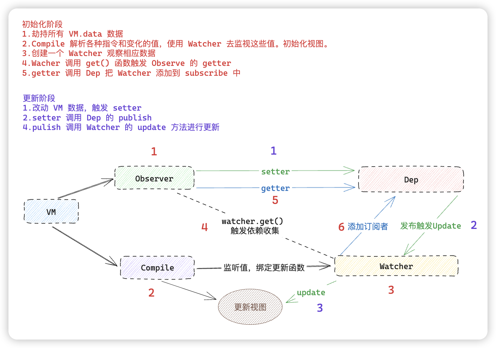
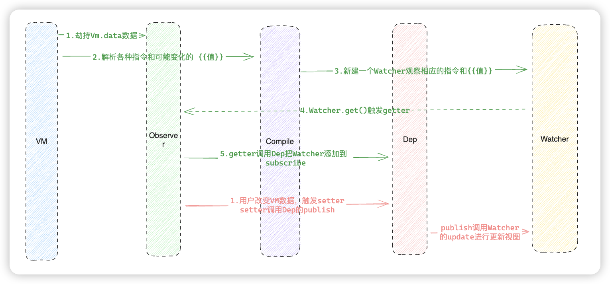

# 简介
模拟一个简易的 Vue2 MVVM 模式

# 启动

## 构建简介
- 包管理：pnpm
- 语言：TS
- 构建工具： rollup

## 启动的流程
pnpm watch 启动 **rollup** 的 watch 模式。

1.安装依赖
```shell
pnpm install
```

```shell
pnpm watch
```


1. rollup 打包到 dist 中
2. example.html 引入 dist/index.js 文件
3. 双击打开 index.html 进行**预览**。

## 流程图


